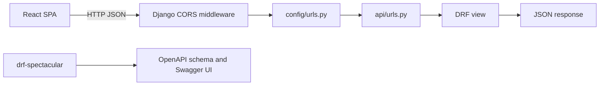

# Backend Tutorial

This file explains what the backend stack is for and how interns should extend it. Installation commands are in [SETUP.md](SETUP.md).

## Technology Roles

- Django owns the backend project, settings, URL routing, migrations, and admin.
- Django REST Framework owns JSON API views and API test helpers.
- SimpleJWT owns API access and refresh tokens.
- drf-spectacular generates OpenAPI schema and Swagger UI.
- django-cors-headers allows the Vite dev server to call the API locally.
- Docker supplies repeatable app and CI builder containers.

## Request Flow



## Structure to Keep

```text
backend/
  accounts/         Custom user model, registration, login, JWT issuance
  api/              Shared API endpoints until domain apps are introduced
  config/           Django settings, ASGI/WSGI, root URLs
  docs/             Backend setup and tutorial
  Dockerfile        Backend development and test images
  manage.py
  requirements.txt
```

As the project grows, create domain apps beside `api/`, for example `cats/`, `rescues/`, or `shelters/`. Keep app-local serializers, views, URLs, permissions, and tests inside that app.

## API Conventions

- Put URL declarations in the app's `urls.py`.
- Keep views thin; move business rules into service modules when logic becomes reusable.
- Add Django unit tests for model and view behavior.
- Keep OpenAPI clean by using DRF serializers for request and response shapes.

## Configuration Files

- `config/settings.py` reads local and Docker values from environment variables.
- `requirements.txt` pins backend runtime dependencies.
- `Dockerfile` has `development` and `test` targets.

## Adding an Endpoint

1. Create a serializer if the endpoint accepts or returns structured data.
2. Add a DRF view or viewset.
3. Register it in the app's `urls.py`.
4. Add Django tests in the app.
5. Generate OpenAPI and check that the endpoint is documented.
