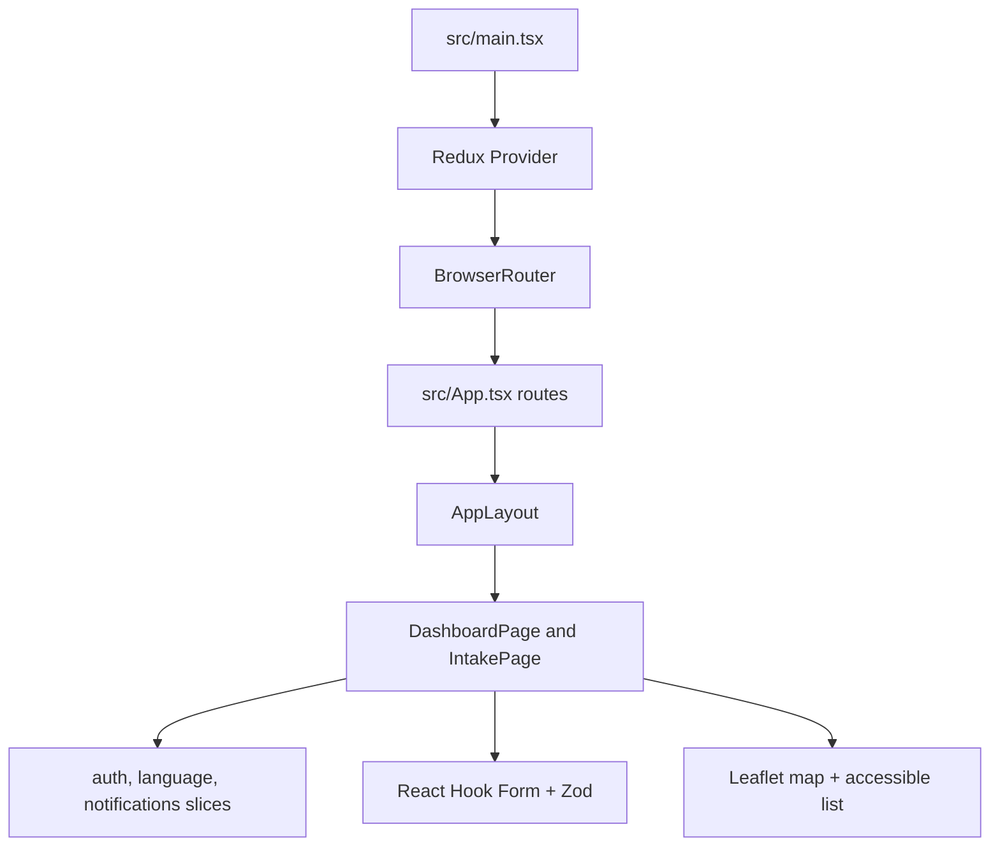

# Frontend Tutorial

This file explains the frontend stack and structure interns should follow. Installation commands are in [SETUP.md](SETUP.md).

## Technology Roles

- React renders the SPA.
- Vite runs the dev server and production build.
- Yarn is the package manager and lockfile owner.
- React Router owns page routing.
- Redux Toolkit owns global state for auth user, language, and notifications.
- React Hook Form owns form state.
- Zod owns frontend validation schemas.
- Leaflet renders interactive maps.
- Jest owns unit tests.
- Cypress owns end-to-end browser tests.
- jest-axe, cypress-axe, semantic HTML, labels, focus states, and keyboard paths support WCAG 2.0 accessibility work.

## App Flow



## Structure to Keep

```text
frontend/
  cypress/          E2E specs and Cypress support files
  docs/             Frontend setup and tutorial
  src/
    app/            Store setup and typed Redux hooks
    components/     Shared UI components
    features/       Redux slices grouped by domain
    pages/          Route-level screens
    schemas/        Zod validation schemas
    test/           Test helpers and mocks
  Dockerfile        Development, test, builder, runtime, and Cypress images
```

## Routing Rules

- Register top-level pages in `src/App.tsx`.
- Keep route components in `src/pages`.
- Shared layout belongs in `src/components/AppLayout.tsx`.
- Use links and buttons semantically; do not use clickable divs.

## State Rules

Global state belongs in Redux only when multiple routes or distant components need it. Current global slices are:

- `auth`: current signed-in user
- `language`: selected interface language
- `notifications`: app-level messages

Local form and display state should stay in the component unless it needs to outlive that component.

## Forms and Validation

- Put each reusable Zod schema in `src/schemas`.
- Use React Hook Form with `zodResolver`.
- Connect errors with `aria-describedby`.
- Mark invalid controls with `aria-invalid`.

## Accessibility Baseline

- Every page needs one clear heading.
- Inputs need visible labels.
- Keyboard focus must be visible.
- Dynamic notifications should use live regions.
- Maps need a non-map alternative. The dashboard keeps a location list below the Leaflet map.
- Add Jest or Cypress axe coverage when adding meaningful UI.

## Testing Split

- Jest tests component behavior without opening a browser.
- Jest a11y tests catch automated WCAG regressions early.
- Cypress tests user workflows in a real browser.
- Cypress a11y checks run against the rendered app.
